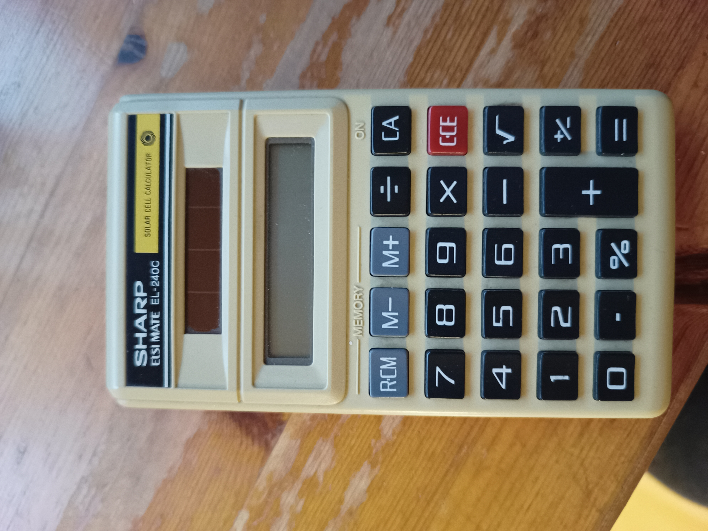

# Sharp ELSI MATE EL-240C

As the closer for the foundational course of the [Odin Project](https://www.theodinproject.com), I made a calculator with a user interface using HTML, CSS, and JavaScript. I decided to make it more difficult for myself (much more than I'd expected) by replicating an old calculator I had lying around at home: The Sharp ELSI MATE EL-240C.

The main challenge was figuring out a mental model for this calculator; how does it 'think', what does it 'remember' as inputs come in? That proved more difficult than I thought as I repeatedly found new functionality and behavior during my physical testing with the calculator. As far as official documentation goes, there is a [2-page manual for the EL-240S](https://www.manualslib.com/manual/489333/Sharp-El-240s.html?page=1#manual) which wasn't of much use, nor did it document all the functionality of this thing. The extent of my frustration with this thing is borne out by the 86 unit tests for what was supposed to be a simple calculator. If you're interested, I've documented more of the logic in [logic.md](./logic.md).

## Three learnings per language

### JavaScript

#### Classes
This was the first I used the `class` shorthand in a project. Something that's stuck by me is how `this` works very differently in JavaScript than in Python: In Python 'pulling out' a method from an instance (e.g. `my_instance.method`) gives you a method object; it comes packed with a reference to the instance, so when calling it later any usage of `self` within the function body will automatically refer to the instance it came from. In JavaScript this isn't the case and you'll have to bind or otherwise provide the intended value for `this` when using the method later. For now this was frustrating, but I can imagine it also adds flexibility in other cases because you don't have to extricate the original function from the method object like in Python. This was relevant within the calculator class where inputs are often mapped to one of several functions, which are methods on the class, that are invoked at a later point.

#### Array indexing
It tripped me up multiple times that you cannot index an array with a boolean directly, but need to cast the boolean to a number first. In my mind JavaScript was *the* language for implicit coercion to make expressions work, but it's good to learn this now and not during debugging of more complex projects.

#### Jest
I'd run tests in prior Odin Project exercises using Jest, but this was the first time I had to set it up myself. Wasn't too difficult, but struggled a bit with getting it to work with ESM modules. It definitely made development much easier though. Initially I only had a handful of tests and when changing something I'd just test it in the browser to check that it still worked. After the combinatorial explosion when I started implementing all the calculation details, writing tests in advance really saved my ass multiple times. Previously I'd always doubted if test-driven development could really work with how often I rewrite things, but in a project like this where the outer interface is very concrete (takes input just like the calculator), test-driven development really fits like a glove.

### HTML

#### Emmett abbreviations
I used Emmett abbreviations to speed up creating multiple similar HTML elements. Not technically a feature of HTML, but definitely cool.

#### Event listeners on parents
Instead of attaching event listeners on each keypad button individually, I can simply attach it to the parent element and rely on the click event bubbling up from the specific button. It's a small thing, but I really like how clear it keeps the code that attaches event listeners.

#### Defer on script tags
Don't have to worry about when the browser parser hits the script element and pushes the script code onto the stack if you just defer that until the DOM is ready. Frees me from having to worry about it, so another small, but nice addition.

### CSS

#### Root variables
I tried to be a bit more structured about defining root variables for things like colors and fonts in this project, so I wouldn't be repeating myself in many CSS rules. Still struggling with proper naming and organization, but I'm hoping more practice will improve that naturally. 

#### Transform property
I've only used it here to make it look like a button is getting pressed down, but even by doing that I know the possibilities that you can use this for are endless.

#### Fonts are a pain
This is the first time I've searched for fonts myself that matched what I wanted and it's hard. I'm sure it's partly because I don't know much about typography, so I lack the vocabulary to really describe what fonts look like and what differentiates them. I assume web developers build their own collections of fonts they've gathered (whose license allows using them for those projects) that they can then just drop into the various projects they work on, so I guess this is the start of my collection.
